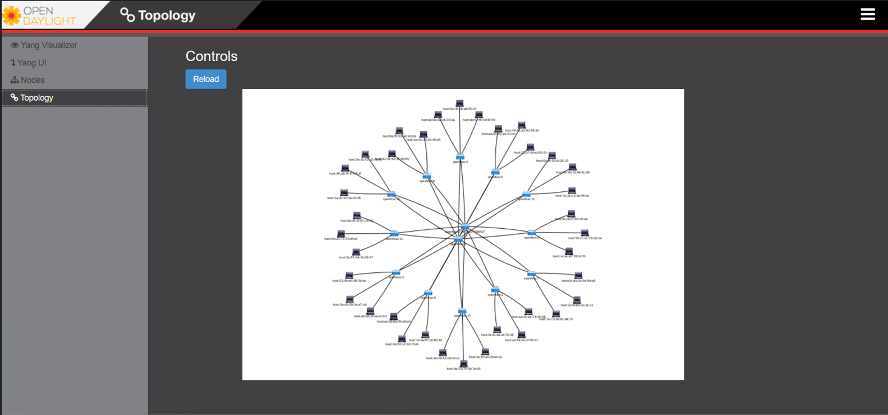
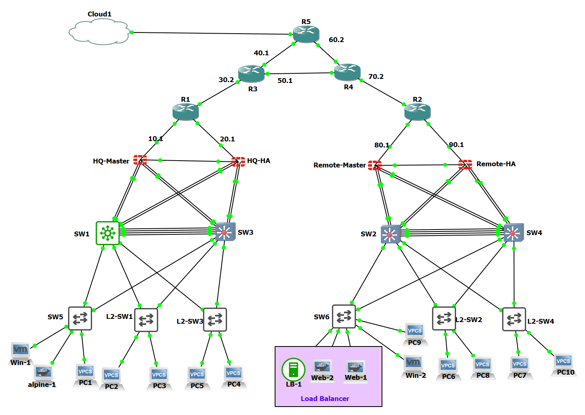

# 🧠 Graduation Project - SDN & Traditional Network Data Center with Blockchain Security

### 🎓 Faculty of Computers and Information, Menoufia University  
**Department of Information Technology**  
**Supervisor:** Prof. Hatem Mohamed Said

---

## 📌 Project Overview

Our graduation project presents a **hybrid network infrastructure** that consists of two main parts:

- 🧠 **SDN-based Data Center** using OpenDaylight & Private Blockchain  
- 🌐 **Traditional Network** simulated in GNS3 with real-world technologies

Both parts are fully virtualized and connected to simulate **The two branch offices**. The **SDN branch** utilizes advanced programmable networking with security via blockchain, while the **traditional branch** focuses on real-world enterprise networking technologies.

---

## 🧠 SDN Branch

Built using Mininet and OpenDaylight (OpenFlow 1.3), this branch allows centralized control over the network topology, dynamic flow management, and blockchain-secured communication between switches.

### Features:
- SDN topology built using **Mininet**
- Centralized controller: **OpenDaylight**
- Secured switch communication using a **Private Blockchain module (Python)**
- Server running a **Dockerized web application** with access roles:
  - Developer: can push code and access the database  
  - User: can only access the application service  
- Entire topology virtualized using **VMware**

---

## 🌐 Traditional Network Branch (GNS3)

A fully functional enterprise network simulating real-world infrastructure and services. It includes two branches built with routers, firewalls, and switches in **GNS3**.

### Implemented Technologies:
- 🔒 **Site-to-Site VPN**  
- 💡 **Link Aggregation (EtherChannel)**  
- 🌈 **VLANs & Inter-VLAN Routing**  
- 🌍 **Routing Protocols: BGP (ISP Simulation)**  
- 🔥 **Firewall Policies (FortiGate)**  
- 📦 **Firewall DHCP Server**  
- ♻️ **High Availability (HSRP / Failover)**  

---

## 🛠️ Tools & Technologies Used

- 🔁 **SDN (Software Defined Networking)**  
- 🌐 **Mininet**  
- 🧠 **OpenDaylight Controller (OpenFlow 1.3)**  
- 🔒 **Python-based Private Blockchain**  
- 🐳 **Docker** for Web Application  
- ☁️ **VMware Workstation**  
- 🧪 **GNS3** for traditional network simulation  
- 🔌 **Virtual Routers, Switches, Fortigate Firewalls**  
- 🐧 **Linux & CLI-based Networking**

---

## 📸 Topology Snapshots

>   
> 

---
## 🎥 Project Presentation

The full presentation is available on Canva:  
🔗 [View Presentation on Canva](https://www.canva.com/design/DAGrnWhJmpE/yi57Dm44qBhPBSYQxmK9Pg/editutm_content=DAGrnWhJmpE&utm_campaign=designshare&utm_medium=link2&utm_source=sharebutton)

---
## 📄 Documentation

You can find the full technical documentation in PDF format here:  
📥 [Download Project Documentation](./documentation/Project_Documentation.pdf)
